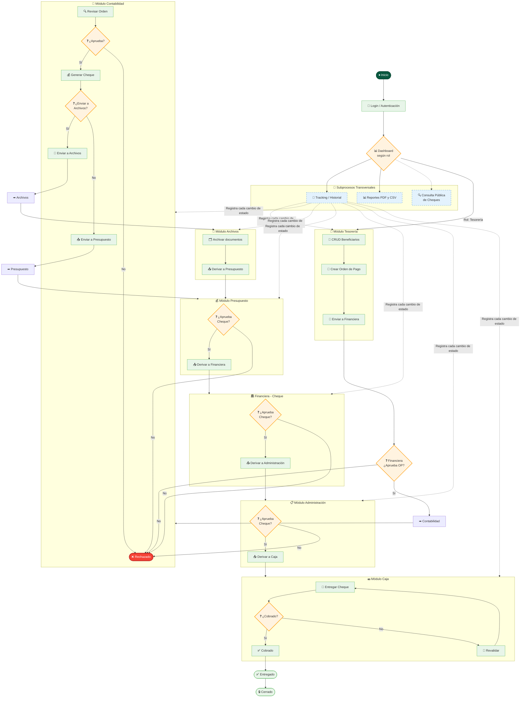

# Diagrama de Flujo — Sistema Integral de Pago CPS

## Descripción del Flujo

### Flujo Principal de Aprobación

| Paso | Responsable | Acción |
|------|-------------|--------|
| 1 | Tesorería | Crea beneficiarios y órdenes de pago |
| 2 | Financiera | Aprueba o rechaza la orden de pago |
| 3 | Contabilidad | Aprueba, genera cheque, decide si envía a Archivos |
| 4 | Archivos | Archiva documentos y deriva a Presupuesto |
| 5 | Presupuesto | Aprueba o rechaza el cheque |
| 6 | Financiera | Aprueba o rechaza el cheque |
| 7 | Administración | Aprueba o rechaza el cheque |
| 8 | Caja | Entrega el cheque, registra cobro o revalida |
| 9 | — | Orden marcada como Entregada → Cerrada |

### Estados Posibles

| Estado | Descripción |
|--------|-------------|
| `pendiente_tesoreria` | Creada por Tesorería, esperando envío |
| `en_financiera` | En revisión de Financiera |
| `en_contabilidad` | En revisión de Contabilidad |
| `en_archivos` | En archivado de documentos |
| `en_presupuesto` | En revisión de Presupuesto |
| `en_financiera_cheque` | En revisión de cheque por Financiera |
| `en_administracion` | En revisión de Administración |
| `en_caja` | En proceso de entrega |
| `entregado` | Cheque entregado al beneficiario |
| `cerrado` | Proceso finalizado |
| `rechazado` | Rechazado en cualquier etapa (terminal) |

### Subprocesos Transversales

- **Tracking/Historial**: Registra cada cambio de estado con fecha, usuario, área origen/destino y comentarios.
- **Reportes**: Generación de reportes en PDF y CSV por rango de fechas, área, tipo, etc.
- **Consulta Pública**: Cualquier persona puede consultar el estado de un cheque por su número (ruta pública).

---

*Documento generado para el informe del Sistema Integral de Pago CPS — Caja Petrolera de Salud, Cochabamba, Bolivia.*
